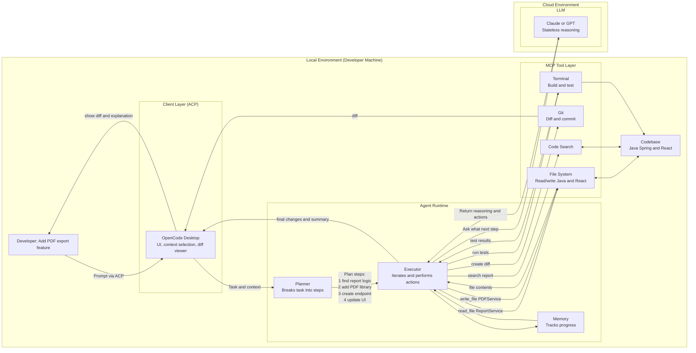

# AI-coding
AI coding

```mermaid
flowchart LR

%% =========================
%% LOCAL ENVIRONMENT
%% =========================
subgraph LOCAL["Local Environment (Developer Machine)"]

    U["Developer: Add PDF export feature"]

    subgraph CLIENT["Client Layer (ACP)"]
        OC["OpenCode Desktop\nUI, context selection, diff viewer"]
    end

    subgraph AGENT["Agent Runtime"]
        P["Planner\nBreaks task into steps"]
        E["Executor\nIterates and performs actions"]
        M["Memory\nTracks progress"]
    end

    subgraph MCP["MCP Tool Layer"]
        FS["File System\nRead/write Java and React"]
        GIT["Git\nDiff and commit"]
        TERM["Terminal\nBuild and test"]
        SRCH["Code Search"]
    end

    CODE["Codebase\nJava Spring and React"]
end

%% =========================
%% CLOUD ENVIRONMENT
%% =========================
subgraph CLOUD["Cloud Environment"]

    subgraph LLM_LAYER["LLM"]
        LLM["Claude or GPT\nStateless reasoning"]
    end

end

%% =========================
%% USER INTERACTION
%% =========================
U -->|Prompt via ACP| OC

%% =========================
%% CLIENT TO AGENT
%% =========================
OC -->|Task and context| P

%% =========================
%% AGENT FLOW
%% =========================
P -->|Plan steps:\n1 find report logic\n2 add PDF library\n3 create endpoint\n4 update UI| E
E --> M
M --> E

%% =========================
%% AGENT TO LLM
%% =========================
E -->|Ask what next step| LLM
LLM -->|Return reasoning and actions| E

%% =========================
%% AGENT TO TOOLS
%% =========================
E -->|read_file ReportService| FS
E -->|search report| SRCH
E -->|write_file PDFService| FS
E -->|run tests| TERM
E -->|create diff| GIT

%% =========================
%% TOOLS TO CODEBASE
%% =========================
FS <--> CODE
SRCH <--> CODE
TERM --> CODE

%% =========================
%% RESULTS BACK
%% =========================
FS -->|file contents| E
TERM -->|test results| E
GIT -->|diff| OC

%% =========================
%% FINAL OUTPUT
%% =========================
E -->|final changes and summary| OC
OC -->|show diff and explanation| U
```
